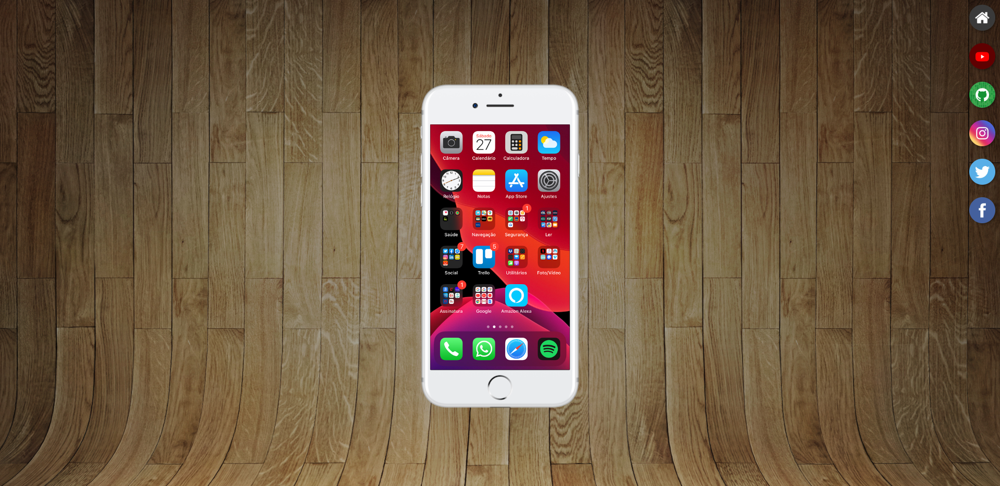

# Projeto-Social
> Projeto feito no módulo 4 do curso HTML e CSS do CursoemVideo.
>
> Neste mini projeto usei o iframe e imagens para colocar no celular.
>
## 🖥️ [Veja o site no ar](https://rfluan.github.io/projeto-social/)

